# RTLMap contrastive architecture

_Single-figure specification for the joint contrastive model and training objective._

---

## Model structure

The contrastive-learning mode in RTLMap is a supervised joint training architecture over triples `(test_a, test_b, merged)`. It is not an InfoNCE, SimCLR, memory-bank, or batch-negative design. The model learns a test-conditioned RTL representation and aligns a hyperrectangle overlap score with the coverage-set Jaccard similarity inferred from merged coverage targets.

The complete model structure is summarized in one figure below. This figure is intended to be the source layout for a paper-quality architecture diagram: keep the four visual regions, draw `test_a` and `test_b` as tied-weight branches, and draw `merged` as a feature-level union path rather than a third encoder forward.

```mermaid
flowchart LR
    accTitle: RTLMap Joint Contrastive Architecture
    accDescr: Complete joint contrastive architecture showing triple inputs, tied dual-graph encoders for test a and test b, hyperrectangle set representations, merged union prediction, and all supervised and contrastive losses.

    subgraph data_region ["A. Contrastive triple data"]
        rtl_a["RTL CDFG a<br/>same module topology<br/>edge labels_a, y_a"]
        asm_a["ASM CDFG a<br/>test stimulus context"]
        rtl_b["RTL CDFG b<br/>same module topology<br/>edge labels_b, y_b"]
        asm_b["ASM CDFG b<br/>test stimulus context"]
        rtl_m["Merged RTL reference<br/>same topology<br/>edge labels_m, y_m"]
        jaccard_target["Coverage Jaccard target<br/>s_ab = mean_k((y_a + y_b - y_m) / y_m)"]
    end

    subgraph shared_encoder_region ["B. Shared DualGraphFusionModel, reused for a and b"]
        subgraph branch_a ["Tied branch for test_a"]
            feat_a["Feature encoders<br/>RTL node: cell + width<br/>RTL edge: type + width + ports<br/>ASM node: type + adapter(instruction)<br/>ASM edge: type"]
            gnn_a["L repeated dual-graph layers<br/>RTL ControlGatedGNNLayer<br/>ASM GNNLayer<br/>bidirectional PerceiverCrossFusion"]
            pool_a["RTL projection + mean pool<br/>rtl_final_a, rtl_graph_a"]
            heads_a["Shared heads on RTL<br/>EdgeClassifier<br/>GraphRegressor<br/>HyperrectangleHead"]
            out_a["out_a<br/>edge_logits_a<br/>graph_pred_a<br/>hyper_min_a, hyper_max_a"]
        end

        subgraph branch_b ["Tied branch for test_b"]
            feat_b["Feature encoders<br/>same modules and weights"]
            gnn_b["L repeated dual-graph layers<br/>same modules and weights"]
            pool_b["RTL projection + mean pool<br/>rtl_final_b, rtl_graph_b"]
            heads_b["Shared heads on RTL<br/>same heads and weights"]
            out_b["out_b<br/>edge_logits_b<br/>graph_pred_b<br/>hyper_min_b, hyper_max_b"]
        end
    end

    subgraph set_region ["C. Set representation and merged union path"]
        rect_overlap["Hyperrectangle overlap<br/>mean_i max(0, min(max_a_i,max_b_i)-max(min_a_i,min_b_i))"]
        node_union["Node-level SymmetricUnionFusion<br/>u_N = F(rtl_final_a, rtl_final_b)"]
        graph_union["Graph-level SymmetricUnionFusion<br/>u_G = F(rtl_graph_a, rtl_graph_b)"]
        merged_decode["Merged decoding with shared heads<br/>EdgeClassifier(u_N, merged RTL edges)<br/>GraphRegressor(u_G)<br/>optional HyperrectangleHead(u_G)"]
        out_m["out_m<br/>edge_logits_m<br/>graph_pred_m"]
    end

    subgraph objective_region ["D. Joint objective"]
        loss_a["L_a<br/>edge CE/focal + graph SmoothL1"]
        loss_b["L_b<br/>edge CE/focal + graph SmoothL1"]
        loss_m["L_m<br/>merged edge CE/focal + merged graph SmoothL1"]
        loss_cl["L_cl<br/>MSE/BCE/margin<br/>overlap vs Jaccard"]
        loss_or["optional L_or<br/>BCE(1-(1-p_a)(1-p_b), labels_m)"]
        loss_total["L_total<br/>lambda_ce(L_a+L_b+L_m)<br/>+ lambda_cl L_cl<br/>+ lambda_or L_or"]
    end

    rtl_a --> feat_a
    asm_a --> feat_a
    feat_a --> gnn_a --> pool_a --> heads_a --> out_a

    rtl_b --> feat_b
    asm_b --> feat_b
    feat_b --> gnn_b --> pool_b --> heads_b --> out_b

    out_a --> loss_a
    out_b --> loss_b

    out_a --> rect_overlap
    out_b --> rect_overlap
    jaccard_target --> loss_cl
    rect_overlap --> loss_cl

    pool_a --> node_union
    pool_b --> node_union
    pool_a --> graph_union
    pool_b --> graph_union
    rtl_m --> merged_decode
    node_union --> merged_decode
    graph_union --> merged_decode
    merged_decode --> out_m --> loss_m

    out_a --> loss_or
    out_b --> loss_or
    out_m --> loss_or

    loss_a --> loss_total
    loss_b --> loss_total
    loss_m --> loss_total
    loss_cl --> loss_total
    loss_or -.-> loss_total

    classDef data fill:#dbeafe,stroke:#2563eb,stroke-width:2px,color:#1e3a5f
    classDef model fill:#ede9fe,stroke:#7c3aed,stroke-width:2px,color:#3b0764
    classDef setrep fill:#fef9c3,stroke:#ca8a04,stroke-width:2px,color:#713f12
    classDef objective fill:#dcfce7,stroke:#16a34a,stroke-width:2px,color:#14532d

    class rtl_a,asm_a,rtl_b,asm_b,rtl_m,jaccard_target data
    class feat_a,gnn_a,pool_a,heads_a,out_a,feat_b,gnn_b,pool_b,heads_b,out_b model
    class rect_overlap,node_union,graph_union,merged_decode,out_m setrep
    class loss_a,loss_b,loss_m,loss_cl,loss_or,loss_total objective
```



## Diagram reading order

Read the figure from left to right:

1. `test_a`, `test_b`, and `merged` form one contrastive triple. `a` and `b` each include RTL and ASM graphs; `merged` provides union coverage labels on the same RTL topology.
2. `test_a` and `test_b` pass through the same `DualGraphFusionModel` weights. The diagram draws two branches only to show data flow; the modules are tied.
3. Each branch encodes RTL and ASM features, repeats the dual-graph encoder stack `L` times, pools the final RTL node embeddings, and emits edge logits, graph coverage predictions, and a hyperrectangle.
4. Hyperrectangle overlap is compared against the coverage-derived Jaccard target.
5. The merged branch is built from feature-level union of `out_a` and `out_b`; it is not a third full encoder forward.
6. The training objective combines supervised losses on `a`, `b`, and `merged`, plus the contrastive hyperrectangle alignment loss and optional OR consistency.

## Module details for figure annotation

Use this section as the detailed label source when redrawing the single Mermaid figure into a publication graphic.

| Figure block | Implementation | Essential annotation |
| --- | --- | --- |
| RTL CDFG | `DualGraphData` | Node attributes: `node_cell_type`, `node_type`, `node_width`; edge attributes: `edge_index`, `edge_type`, `edge_width`, source/target port indices |
| ASM CDFG | `DualGraphData` | Node attributes: `asm_node_type`, `asm_instruction_encoding`; edge attributes: `asm_edge_index`, `asm_edge_type` |
| Feature encoders | `models/encoder.py` | RTL node, RTL edge, ASM node, and ASM edge encoders map raw graph attributes into hidden dimension `D` |
| Dual-graph layers | `PerceiverDualEncoder` | Repeated `L` times; contains RTL GNN, ASM GNN, and bidirectional `PerceiverCrossFusion` |
| RTL GNN | `ControlGatedGNNLayer` | Type-aware RTL aggregation for MUX, sequential, memory, arithmetic, compare, shift, and default nodes |
| ASM GNN | `GNNLayer` | Generic message passing with node and edge updates |
| Cross fusion | `PerceiverCrossFusion` | Source graph summarized by `K` latent tokens; target nodes read latent summary through attention and gated residual injection |
| Edge head | `EdgeClassifier` | Uses source node, target node, and encoded edge attributes to predict covered/uncovered logits |
| Graph head | `GraphRegressor` | One coverage head per selected coverage key, applied to mean-pooled RTL graph embedding |
| Hyperrectangle head | `HyperrectangleHead` | Maps graph embedding to `[hyper_min, hyper_max]` in `[0,1]^D` |
| Merged union | `SymmetricUnionFusion` | Order-invariant fusion applied separately to node-level and graph-level RTL features |
| Contrastive loss | `compute_contrastive_loss` | Aligns model-side hyperrectangle overlap with target-side Jaccard |
| Joint loss | `run_joint_training_step` | Optimizes `lambda_ce(L_a+L_b+L_m) + lambda_cl L_cl + lambda_or L_or` |

## Tensor shapes

Let `B` be batch size, `N` RTL nodes, `E` RTL edges, `M` ASM nodes, `F` ASM edges, `D` hidden dimension, and `T` selected coverage targets.

| Tensor | Shape | Meaning |
| --- | --- | --- |
| RTL node embedding | `[N, D]` | Encoded hardware nodes |
| RTL edge embedding | `[E, D]` | Encoded hardware edges |
| ASM node embedding | `[M, D]` | Encoded test-program nodes |
| ASM edge embedding | `[F, D]` | Encoded ASM edges |
| `rtl_final` | `[N, D]` | Final RTL node embeddings after dual-graph fusion |
| `rtl_graph_emb` | `[B, D]` | Mean-pooled RTL graph embedding |
| `edge_logits` | `[E, 2]` | Uncovered/covered logits for RTL edges |
| `graph_pred` | `[B, T]` | Predicted graph coverage rates |
| `hyper_min`, `hyper_max` | `[B, D]` | Hyperrectangle lower and upper corners |
| `similarity` | `[B]` | Coverage-derived Jaccard target |
| `intersection_score` | `[B]` | Mean coordinate-wise hyperrectangle overlap |

## Encoder equations

The branch feature encoders can be written as:

```text
h_rtl_node = LN(Emb(cell_type) + Linear(log2(width + 1)))
h_rtl_edge = Emb(edge_type) + Linear(log2(edge_width + 1)) + PortEmb(src_port, dst_port)
h_asm_node = LN(Emb(asm_node_type) + Linear(Adapter(instruction_encoding)))
h_asm_edge = Emb(asm_edge_type)
```

The ASM instruction adapter is residual:

```text
Adapter(x) = x + W_2 GELU(W_1 LN(x))
```

Each encoder layer follows:

```text
h_rtl, e_rtl = ControlGatedGNNLayer(h_rtl, e_rtl, edge_type, node_type, target_port)
h_asm, e_asm = GNNLayer(h_asm, e_asm)
h_rtl' = PerceiverCrossFusion(target=h_rtl, source=h_asm)
h_asm' = PerceiverCrossFusion(target=h_asm, source=h_rtl)
```

For the Perceiver fusion, source nodes are first compressed into `K` learned latent tokens, then target nodes read from those latent tokens:

```text
Z = MHA(query=latents, key=LN(source), value=LN(source))
context = MHA(query=LN(target), key=Z, value=Z)
target_out = target + sigmoid(W[target; context]) * MLP(LN(context))
```

## Hyperrectangle set representation

The graph embedding `g = rtl_graph_emb` is mapped to a differentiable hyperrectangle:

```text
v_min = sigmoid(W_min g + b_min)
extent = sigmoid(W_extent g + b_extent)
v_max = v_min + margin + extent * (1 - v_min - margin)
R(g) = [v_min, v_max] subset [0,1]^D
```

This parameterization enforces:

| Constraint | Mechanism |
| --- | --- |
| `v_min in [0,1]` | Sigmoid lower corner |
| `v_max >= v_min + margin` | Explicit minimum extent |
| `v_max <= 1` | Extent scaled by remaining unit-cube capacity |
| Differentiability | No clamp in the rectangle parameterization |

The model-side similarity between `a` and `b` is:

```text
overlap_i = max(0, min(max_a_i, max_b_i) - max(min_a_i, min_b_i))
intersection_score = mean_i(overlap_i)
```

It is a mean overlap length, not a hyperrectangle volume product and not an IoU. This matters for drawing: represent it as coordinate-wise overlap aggregation, not as full-volume intersection.

## Merged union branch

The merged branch uses `SymmetricUnionFusion` instead of forwarding the merged sample through the encoder. For aligned tensors `f_a` and `f_b`:

```text
u = [f_a + f_b ; max(f_a, f_b) ; abs(f_a - f_b) ; f_a * f_b]
gate = sigmoid(MLP(u))
h_base = 0.5 * (f_a + f_b)
h_max = max(f_a, f_b)
f_union = LayerNorm(gate * h_max + (1 - gate) * h_base)
```

This fusion is used twice:

| Fusion | Inputs | Output | Decoder |
| --- | --- | --- | --- |
| Node union | `out_a.rtl_final`, `out_b.rtl_final` | `u_N` | `EdgeClassifier` on merged RTL reference edges |
| Graph union | `out_a.rtl_graph_emb`, `out_b.rtl_graph_emb` | `u_G` | `GraphRegressor` for merged coverage |

The merged supervised loss includes both edge classification and graph coverage regression:

```text
L_m = L_edge(out_m, labels_m) + L_graph(out_m, y_m)
```

## Losses

The target-side Jaccard supervision is computed from coverage rates:

```text
Jaccard_k(a,b) = (cov_a,k + cov_b,k - cov_merged,k) / cov_merged,k
s_ab = mean over valid k of Jaccard_k(a,b)
```

The contrastive objective supports three modes:

| Mode | Objective |
| --- | --- |
| `mse` | `MSE(intersection_score, s_ab)` |
| `bce` | `BCE(clamp(intersection_score), s_ab)` |
| `margin` | Similar pairs use MSE; dissimilar pairs penalize `intersection_score > margin` |

The total joint objective is:

```text
L_ce = L_a + L_b + L_m
L_a = L_edge(out_a, labels_a) + L_graph(out_a, y_a)
L_b = L_edge(out_b, labels_b) + L_graph(out_b, y_b)
L_m = L_edge(out_m, labels_m) + L_graph(out_m, y_m)

L_total = lambda_ce * L_ce + lambda_cl * L_cl + lambda_or * L_or
```

`L_or` is optional and disabled by default:

```text
p_or = 1 - (1 - p_a) * (1 - p_b)
L_or = BCE(p_or, merged_edge_labels)
```

## Notes for paper figure drawing

Use the Mermaid diagram as the only structural figure. In a paper graphic, convert it into a four-panel figure:

| Panel | What to draw | Required visual detail |
| --- | --- | --- |
| A | Triple data | `test_a`, `test_b`, and `merged` share RTL topology; only `a` and `b` have ASM stimulus graphs |
| B | Tied dual-graph encoder | Two visually parallel branches with a clear "shared weights" mark |
| C | Set and union operations | Hyperrectangle overlap for contrastive alignment; node and graph union for merged prediction |
| D | Joint objective | `L_a`, `L_b`, `L_m`, `L_cl`, optional `L_or`, and weighted total loss |

Do not include a temperature parameter, all-pairs similarity matrix, memory bank, explicit negative sampler, or third merged encoder pass. Those concepts are not present in the implementation and would misrepresent the model.

## Key implementation files

| Purpose | File |
| --- | --- |
| CLI switches and automatic hyperrectangle enabling | `main.py` |
| Model config and output dataclasses | `models/data_types.py` |
| Shared dual-graph model and merged decoding | `models/model.py` |
| RTL/ASM encoder stack | `models/encoder.py` |
| Perceiver cross-fusion | `models/interaction.py` |
| Prediction heads | `models/heads.py` |
| Hyperrectangle representation | `models/hyperrectangle.py` |
| Symmetric union fusion | `models/union_fusion.py` |
| Contrastive loss | `models/contrastive_loss.py` |
| Triple data loading | `datasets/triple_datamodule.py` |
| Coverage Jaccard target | `datasets/coverage_similarity.py` |
| Joint training step | `trainer/joint_steps.py` |

